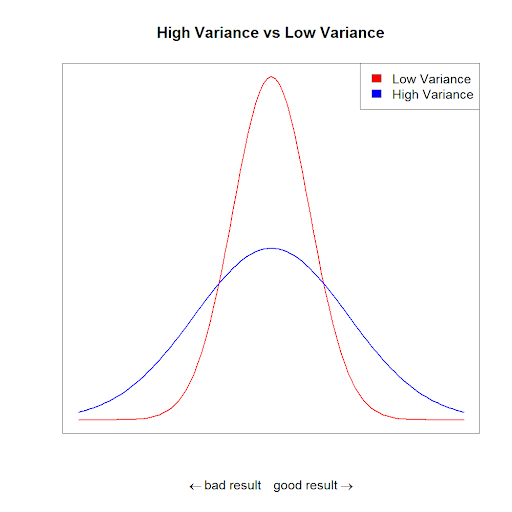
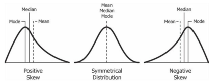
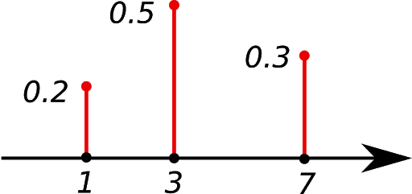
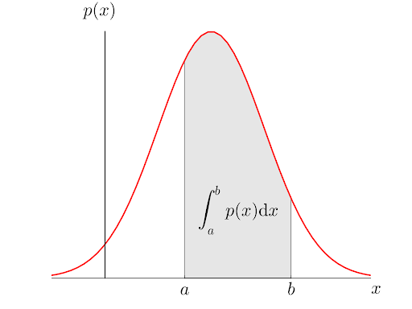
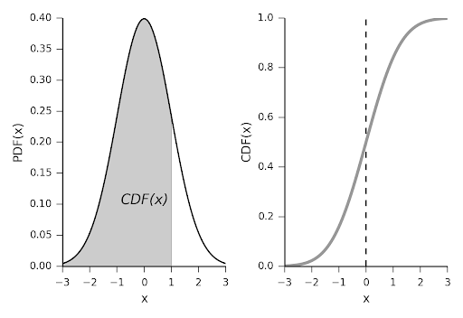
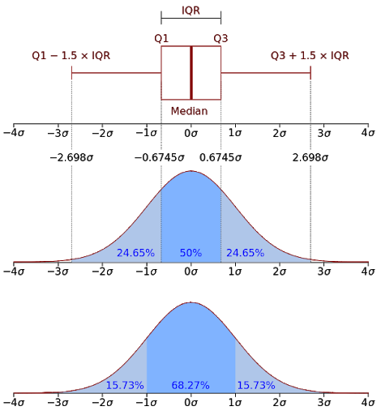

# Notebook Contents   
  - [Introduction](#intro)   
  - [Histograms](#plotting_histogram)    
  - [Variance, standard Deviation](#var_sd)    
  - [Skewness](#skew)   
  - [Probability Distributions, PMF, PDF](#probability_distributions)    
  - [Outliers](#outliers)    
  - [IQR](#iqr)     
  - [Boxplots](#boxplots)     


  


# Introduction{#intro}
Descriptive Statistics is concerned with describing what the data is or what the data shows. We use descriptive statistics to simply describe what our data is. 

It is different to statistical inference, which is where you try to reach a conclusion that extends beyonds what the data shows alone. 


# Histograms {#plotting_histogram}
One of the most common ways to describe a variable is a frequency distribution, which is referred to as a histogram.    
It's purpose is to graphically summarize the distribution of a univariate data set.   

We create a histogram by splitting the range of the data into equal-sized bins. Then for each bin, the number of points from the data set that fall into each bin are counted. The higher that the bar is, the greater the frequency of data values in that bin.

  - The horizontal axis is the variable
  - The vertical axis is the frequency (counts for each bin)

## Frequency Histogram  
A regular histogram is a frequency histogram. It has frequency (counts) on the y-axis as explained above.    

To demonstrate how to plot a frequency histogram in R, we will use the built-in R dataset "iris"     
The `hist()` function allows us to compute a histogram in R.  

The histogram representing the Sepal Length from the iris dataset can be seen below.    
The x-axis represents the sepal length, and the y-axis represents the frequency (a count of the number of times that sepal length occurs in the dataset).    

```{r}
#load library "datasets" to get PlantGrowth data
library(datasets) 

#check what columns there are in PlantGrowth dataset
colnames(PlantGrowth)

#create histogram using the column "weight" 
hist(PlantGrowth$weight)

```

## Relative Frequency Histogram
A relative frequency histogram shows the frequency (counts) as percentages. This means that the y-axis represents probability densities and the histogram has a total area of one. 

Using the same Sepal Length data as in the frequency histogram above, we will plot a relative frequency histogram.  
The x-axis represents the weight, and the y-axis represents the **relative frequency** (a percentage of the whole).    


```{r}
#adding the argument freq=FALSE
hist(PlantGrowth$weight, freq=FALSE)
```

## Parameters from Histograms
By looking at the histograms, we can visually answer questions such as,    
  - What kind of population distribution does this data come from?    
  - How spread out is the data?     
  - Is the data symmetric or skewed?     
  - Are there outliers in the data?    


# Variance and Standard Deviation{#var_sd}
## Variance


The variance is a measure of how spread out a distribution is. The larger the variance, the further spread out the data. A small variance indicates that the data points tend to be very close to the mean (expected value). 

A high variance indicates that the data points are very spread out from the mean and from each other.




It is the average squared deviation of the observations from their mean. It is a mathematical way to describe how the observations “vary” from the mean.

The formula for the sample variance is:
$$s^{2} = \frac{\sum_{i=1}^{n}
  \left(x_{i} - \bar{x}\right)^{2}}
  {n-1}$$
where $x_{i}$ is observation $i$, and $n$ is number of values in a set.


## Standard Deviation

The square root of the variance is the standard deviation. The variance is hard to interpret as it's unit is the square of the unit of the variable. To get back the original unit, you can take the square root of the variance, which is the standard deviation. 

The sample standard deviation formula is:
$$s = \sqrt{\frac{\sum\limits_{i=1}^{n} \left(x_{i} - \bar{x}\right)^{2}} {n-1}}$$
where $x_{i}$ is observation $i$, and $n$ is number of values in a set.


## Population and Sample Standard Deviation
There are different formulas for calculating the population and sample standard deviation. This is because when we are working with sample, we are ore likely to underestimate the true population variance. We don't have all possible data available, and it is likely that some extreme observations are missing.

To correct for this likely underestimation of the true population variance, we divide the sum of deviations by $n-1$ instead of $n$. This means that sample standard deviation will be slightly higher than when we compute the population variance. 


The population standard deviation is used when the whole population is investigated.
  $$\sigma= \sqrt{\frac{\sum\limits_{i=1}^{n} \left(x_{i} - \mu{}\right)^{2}} {n}}$$


The sample standard deviation is used when you work with a sample.   

As we have divided the sum of deviations by $n-1$ here, the sample standard deviation is called an 'unbiased estimator'.   
If we applyied the formula for calculating the population standard deviation to the sample data (divide the deviations by only $n$), it would result in a biased estimate.


$$\sigma= \sqrt{\frac{\sum\limits_{i=1}^{n} \left(x_{i} - \mu{}\right)^{2}} {n-1}}$$
where $x_{i}$ is observation $i$, and $n$ is number of values in a set.


# Skewness{#skew}
Another important measure to describe a dataset is the skewness. It is the measure of the asymmetry of a probability distribution by looking at how much the probability distribution of a random variable deviates from the normal distribution. 

The formula for skewness is: $$g_1=\frac{m_3}{m_2^{3/2}}$$

where $m_2$ and $m_3$ are the second and third central moments, $n$ is number of observations, and $x_{i}$ is an observation value.

It can also be written as:
$$
\text { Skew }=\sum_{t=1}^{n}\left(x_{i}-\bar{x}\right)^{3} / n /\left(\sum_{t=1}^{n}\left(x_{i}-\bar{x}\right)^{2} / n\right)^{3 / 2}
$$

We categorize a random variable as either having positive, negative or no skew.   

- Negative skewness (left-skew) indicates that the mean of the data values is less than the median
- Positive skewness (right-skew) indicates that the mean of the data values is larger than the median, and the data distribution

The positive and negative skewness can be seen in this image below:




To find the skewness in R, we can use the function `skewness()` from the library `PerformanceAnalytics`.    
We can see that the weight variable has slight negative skewness
```{r}
library(PerformanceAnalytics)

skewness(PlantGrowth$weight)
```


# Probability Distributions (PMF PDF){#probability_distributions}
A probability distribution is a function that describes the likelihood of obtaining each of the possible values that a random variable can be. In other words, it indicates the likelihood of an event or outcome.


To describe the likelihood that random variable takes a specific value of $x$,  
we use the notation $p(x) = ...$ 

The sum of all probabilities for all possible values must equal 1. This implies that the probability for a particular value or range of values must be between 0 and 1.

There are two types of probability distribution: 

- Probability Mass Function (for discrete variables)
- Probability Density Function (for continuous variables)


## Probability Mass Function (PMF):
Discrete random variables have a probability mass function (pmf). The pmf gives the probability of occurence for each random variable.    
The values of PMF always sum up to 1.

An example of a pmf is shown here:   
{width=50%}


## Probability Density Function (PDF)
Continuous random variables have a probability ednsity function (pdf). Any point on the red curve ($p(x)$) represents probabaility of random variable being equal to $x$.
The grey area represents the probability of a continuous random variable falling between, or being exactly equal to, $a$ and $b$.

The area under PDF (or mathematically, its infinite integral) is always equal to 1.

{width=50%}

## Cumulative Distribution Function (CDF
The cumulative distribution function (cdf) provides the probability that the random variable is less than or equal to a particular value. It can be calculated for both discrete and continuous random variables. /
For continuous variables it can be interpreted as the area under the PDF curve until a certain point. /
For discrete variables it is the sum of the values of PMF until a certain point. /

{width=50%}

It is easy to plot the PDFs and CDFs for the typical distributions in R. The functions for each distribution follow this format, where 'name' is replaced by the name of the distribution:

  - `dname()`: probability density function
  - `pname()`: cumulative density function
  - `qname()`: gives the quantiles
  - `rname()`: gives us a random sample from a specific distribution


# Outliers{#outliers}

An outlier is an observation point that is distant from other observations. However, there is no hard-rule for classifying which data point are outliers - the definition for what is a 'distant' value is determined by the analyst.    
It is therefore important to begin with determining what is a 'normal' observation. 

Interquartile range, boxplots and histograms can be used to understand 'normal' data observations and form a starting point for detecting outliers. These will be covered below. 

In addition to being able use statistical techniques to detect outliers, it is also important to understand why their detection is important. 

The presence of outliers will usually affect parametric statistical results, which is why we may want to find them and remove them. If an outlier is due to some variability in the measurement or the data is entered incorrectly, the resulting action after their detection would be to remove them or change them to the real value of the data if it's known because it is just noise. 


On the other hand, we may find an outlier that indicates something scientifically interesting. In this case, removing it would not be the best way to deal with it. It may be a valid and important data value that impacts the results you are looking for. It would be better to think carefully about what the outlier represents and whether it would be better to keep it or remove it. 


# IQR{#iqr}

The interquartile range (IQR) is a method to objectively identify outliers:

A quantile defines a particular part of a data set, i.e. a quantile determines how many values in a distribution are above or below a certain limit. Special quantiles are the quartile (quarter), the quintile (fifth) and percentiles (hundredth).

The difference between the 75th percentile (Q3) and 25th percentile (Q1) gives you the IQR. 

It is therefore the range spanned by the middle half of the data or the range between the lower and upper quartile (hence, interquartile range).


Using the IQR method, outliers are defined as: 

- $ < ( Q1 − 1.5 x IQR)$ or 
- $ > (Q3 + 1.5 x IQR)$




We can calculate the interquartile range (IQR) using the `IQR()` function
```{r}
IQR(PlantGrowth$weight)
```

We can see all quantiles by typing the following:
```{r}
quantile(PlantGrowth$weight)
```

Or just to see the 25% and 75% we can type:
```{r}
quantile(PlantGrowth$weight, probs=c(.25, .75))
```


# Boxplots{#boxplots}
Outliers and IQRs can be nicely visualized by boxplots. A boxplot is a way of displaying the distribution of the data by highlighting the minimum and maximum data points, Q1, Q3 and the medium. It can also illustrate the outliers that have been calculated using the IQR method. 

A basic boxplot is shown below:
```{r}
library(ggplot2)

#mtcars dataset is natively available
ggplot(mtcars, aes(x=as.factor(cyl), y=mpg)) + 
    geom_boxplot(fill="slateblue", alpha=0.2) + 
    xlab("cyl")
```


